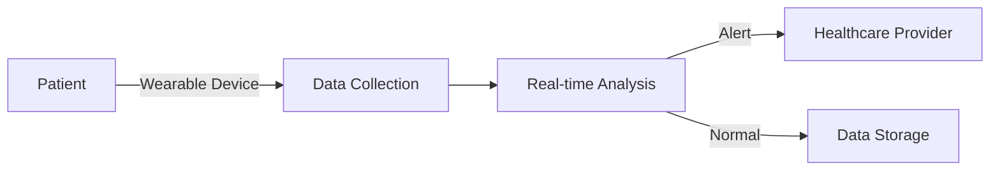
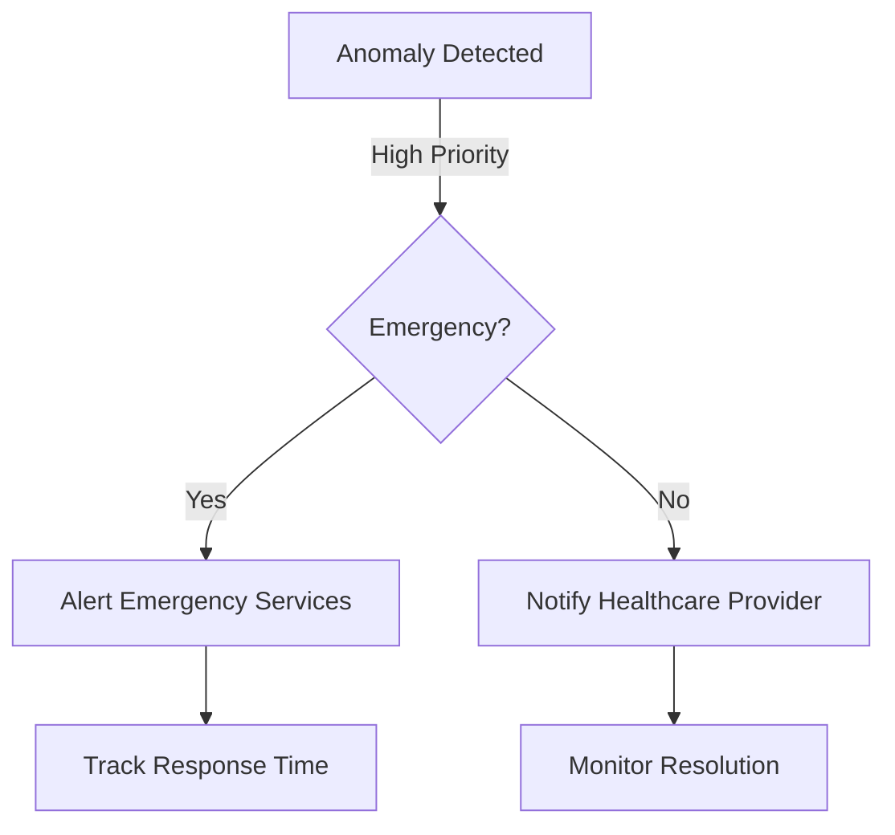

# 🏥 MedGuardian - AI-Powered Health Monitoring Platform


[](https://opensource.org/licenses/MIT)
[](https://reactjs.org/)
[](https://tailwindcss.com)
[](https://nodejs.org/)

## 🌟 Features

### Real-Time Health Monitoring
- 💓 Continuous heart rate tracking
- 🫁 Blood oxygen level monitoring
- 🌡️ Blood pressure measurement
- 📊 Real-time data visualization

### Smart Alert System
- ⚡ Instant anomaly detection
- 🚨 Multi-level alert priorities
- 📱 Mobile notifications
- 🏥 Emergency service integration

### AI-Powered Analysis
- 🤖 Machine learning-based predictions
- 📈 Trend analysis
- ⚠️ Early warning system
- 🎯 Personalized health insights

## 🚀 Quick Start

### Prerequisites
```bash
node.js >= 14.x
npm >= 6.x
```

### Installation

1. **Clone the repository**
```bash
git clone https://github.com/your-username/medguardian.git
cd medguardian
```

2. **Install dependencies**
```bash
npm install
```

3. **Set up environment variables**
```bash
cp .env.example .env
# Edit .env with your configuration
```

4. **Start the development server**
```bash
npm run dev
```

Visit `http://localhost:3000` to see MedGuardian in action! 🎉

## 🔧 Tech Stack

### Frontend
- ⚛️ React.js
- 🎨 Tailwind CSS
- 📊 Recharts
- 🔌 WebSocket

### Backend
- 🚀 Node.js
- 📡 WebSocket Server
- 🗄️ MongoDB
- 🔐 JWT Authentication

### AI/ML Components
- 🧠 TensorFlow.js
- 📉 Anomaly Detection
- 📊 Time Series Analysis

## 🎮 Demo

### Dashboard Overview


### Alert System


## 🎯 Use Cases

### 1. Remote Patient Monitoring


### 2. Emergency Response


## 🛠️ Configuration

### Environment Variables
```env
REACT_APP_API_URL=your_api_url
REACT_APP_WS_URL=your_websocket_url
REACT_APP_MAP_KEY=your_map_api_key
```

### Alert Thresholds
```javascript
{
  "heartRate": {
    "warning": {
      "min": 60,
      "max": 100
    },
    "critical": {
      "min": 50,
      "max": 120
    }
  }
  // ... other vital signs
}
```

## 🤝 Contributing

We love contributions! Here's how you can help:

1. Fork the repository
2. Create your feature branch
   ```bash
   git checkout -b feature/AmazingFeature
   ```
3. Commit your changes
   ```bash
   git commit -m 'Add some AmazingFeature'
   ```
4. Push to the branch
   ```bash
   git push origin feature/AmazingFeature
   ```
5. Open a Pull Request

## 📜 License

This project is licensed under the MIT License - see the [LICENSE.md](LICENSE.md) file for details.

## 🙏 Acknowledgments

- Nokia for providing connectivity solutions
- Open source medical datasets
- Healthcare professionals who provided domain expertise

## 📞 Support

Having issues? Let's talk!

- 📧 Email: support@medguardian.com
- 💬 Discord: [Join our server](https://discord.gg/medguardian)
- 🐦 Twitter: [@MedGuardian](https://twitter.com/medguardian)

## 🚀 Future Roadmap

- [ ] Machine Learning model improvements
- [ ] Mobile app development
- [ ] Integration with more medical devices
- [ ] Multi-language support
- [ ] Advanced analytics dashboard

---

<div align="center">
  Made with ❤️ by the MedGuardian Team
</div>